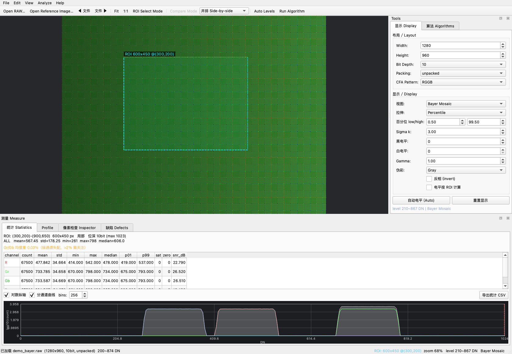

# RAW Viewer —— CMOS 传感器 RAW 图预览 / 测量 / 缺陷分析工具

面向 sensor 测试开发日常：拿到一份 *headerless* RAW dump 之后，快速看清它、
量出关键指标、找出坏点坏线、把结论导出成可以交给别人的表格和图。

PyQt6 + numpy，无其他依赖（16bit PNG/TIFF 导出是手写的，不依赖 PIL/OpenCV）。

```
python -m venv .venv && source .venv/bin/activate
pip install -r requirements.txt     # PyQt6, numpy
python main.py
```



---

## 1. 打开文件：先解决"这份 dump 到底怎么解"

`File → Open RAW…` 弹出的参数对话框和旧版完全不同：

| 能力 | 说明 |
|---|---|
| **按文件大小自动推断** | 双击候选即套用。会匹配常见 sensor 分辨率，并识别行 padding（`stride`）、位深、packed 组合。 |
| **实时尺寸校验** | 底部随时显示 `行字节 / 单帧大小 / 需要多少字节 / 文件实际多少字节`，匹配则绿色 ✔，不足则红色 ✘。旧版是"读到后面才发现对不上"或静默截断。 |
| **完整布局参数** | packing（MIPI RAW10/12/14 packed）、header 字节、行 stride、字节序（little/big）、左对齐位移 `data_shift`、多帧文件的帧号 / 帧 stride。 |
| **参数预设** | 常见的几种 dump 布局存成预设（QSettings 持久化），下次一键套用。 |
| **CFA 默认 Mono** | 灰度数据不会被默认染成彩色网点（旧版默认 RGGB，是个坑）。 |

支持的读取格式：

* `unpacked`：8 / 10 / 12 / 14 / 16 bit（10/12/14bit 可放在 16bit 容器里，用 `data_shift` 右移对齐）；
* `packed`：MIPI RAW10（4px/5B）、RAW12（2px/3B）、RAW14（4px/7B）——位序按 MIPI/V4L2 规范实现，并与公开 C 实现逐位对拍（见 `tests/test_raw_io.py`）；
* 行 stride / header / 大小端 / 多帧（`PgUp/PgDn` 换文件，`,`/`.` 换帧号）。

## 2. 看得清：显示管线

`Display` 页签里的每一步都是显式的，方便你解释"屏幕上看到的到底是什么"：

* **视图**：`Bayer Mosaic`（相位着色）、`Bayer Demosaic`（双线性）、`Mono`、以及单通道 `R / Gr / Gb / B / G plane`。
  单通道视图保持与 raw 相同的 H×W 坐标（非本相位像素置黑），所以 ROI、悬浮读数、像素检查器的坐标永远和 raw 一致，坏点定位不会错位。
* **拉伸**：`Fixed(黑白电平) / Min-Max / Percentile / Sigma`。
  暗场里只有几个亮坏点时百分位区间会退化成一条线（整幅全黑或全白），此时自动回退到 `mean±3σ`；完全均匀的画面也会给中间灰，不会一片死黑。
* **黑/白电平、Gamma、反相、伪彩**（Gray / Jet / Turbo / Hot / Viridis）。
* **自动电平 (Ctrl+L)**：把当前画面的百分位电平写死成固定黑白电平，方便锁定显示做前后对比。
* 缩放/平移后像素块严格对齐到整数物理像素（沿用之前修好的渲染路径），放大到单像素时块等宽、与网格线严格重合；`G` 切像素网格+数值，`C` 切十字线。

## 3. 量得准：ROI 与测量面板

在图上**右键拖拽**（或打开 `ROI Select Mode` 后左键拖拽）框选 ROI，底部 `Measure` 面板立刻跟着更新：

* **Statistics**：总体 + 分通道（R/Gr/Gb/B）的 count / mean / std / min / max / median / P1 / P99 / 饱和数 / 0DN 数 / SNR(dB)；
  自动提示"饱和像素 x 个（可能过曝）"、"0DN 像素 x 个"、"Gr/Gb 均值差 x%"（绿通道失配）。下面是直方图（可切对数纵轴、分通道曲线、bins）。
* **Profile**：ROI 的行/列均值曲线（含分通道曲线与 ±3σ 包络），行 FPN、坏行、阴影一眼可见；鼠标悬停读数，单击可定位。
* **像素检查 Inspector**：单击画布任意像素，看它周围 (2r+1)² 的原始 DN，按相位着色，标出中心点与邻域通道和 —— 定位坏点时用。
* **缺陷 Defects**：见下一节。

ROI 尽量用全局像素坐标计算相位，**奇数起点的 ROI 也不会串通道**（`utils/cfa.py::phase_planes`），这是所有分通道统计正确的前提。

## 4. 找得出：算法

`Algorithms` 页签，勾选"只在 ROI 内运行"可以做局部缺陷扫描。运行结果会累积到缺陷清单里（可导出成一张 CSV）。

| 算法 | 关键点 |
|---|---|
| **Bad Pixel Detection** | 同色邻域中值比对（CFA 下 R 只和 R 比）；自适应阈值 `\|Δ\| > max(k·σ_MAD, 最小偏差)`；区分 hot / dead / cluster；2×2 跨相位簇也能识别（先膨胀再连通标记）；大簇自动聚合成一条带包围盒的记录，整行/整列坏点会拆成 `row`/`col` 条目（不会刷出几千条明细）；可选"用同色邻域中值校正"，校正结果可 `Ctrl+Z` 撤销。 |
| **Bad Line Detection** | 按相位分平面后用**相邻行的局部中值**作参考，所以画面有阴影/暗角梯度时不会整片误报（用全图 median 的写法会）；支持整行/整列或分段（`block_size`）检测，多相位命中的同一行会合并成一条。 |
| **Shading / Vignetting** | 分块统计各相位均值，报告 shading 幅度、块极值、四角/中心比；标出异常块；可选生成平坦场校正图。 |
| **Saturation / Clipping** | 分通道饱和/0DN 计数与比例、过曝区域的块状分布、少量饱和像素逐点入清单 —— 曝光与动态范围验收用。 |
| **Frame Diff vs Reference** | 与参考帧比较：PSNR / RMSE / max\|Δ\| / 差异像素比例，列出偏差大的像素。两帧暗场对比可区分随机噪点与固定坏点；跑完校正后对比原图可确认只动了该动的点。 |

## 5. 坐标跳转（定位到指定像素）

工具栏上的 `坐标 X,Y` 输入框（或 `Analyze → Jump to Coordinate…`，快捷键 **Ctrl+G**）：

* 支持直接粘贴各种格式：`1234,567`、`1234 567`、`(1234, 567)`、`x=1234 y=567`，输入非法会红框并禁用按钮；
* **1-based 开关**：Matlab / Excel / 部分测试报告的行列号从 1 开始，勾上即可按 1 开始解释（差 1 像素在坏点定位上是致命的）；
* **缩放选项**：保持当前缩放 / 1:1 / 8× / 20× / 50× / 100×（默认 20×，足够看清 CFA 相位）；
* 跳转后该像素居中显示（按像素中心对齐，不偏半格）、被打上选中十字线、像素检查器自动切到前面并显示它周围的原始 DN；状态栏给出 `X/Y 坐标 + 通道 + DN` 反馈；
* 坐标越界会自动夹回画内并在状态栏注明，不会静默跳错地方；
* 在画布上单击任意像素会把坐标**回填**到输入框，缺陷清单双击定位也会同步 —— 方便"从这里往旁边再跳 5 个像素"。

## 6. 对比与验证

`Ctrl+D` 打开对比模式（`File → Open Reference Image…`，尺寸/布局一致时直接套用当前参数）：

* **并排 Side-by-side**：两幅同步缩放平移；
* **差分 Difference**：`|当前 − 参考|` 用 Hot 伪彩显示，状态栏给出 PSNR/RMSE/max|Δ| —— 检查校正算法改动量最直观；
* **混合 Blend 50%**：叠加对比。

校正类算法（坏点校正、平坦场校正）跑完后，程序会**自动把原图设为参考帧**，直接切到差分视图就能看改动量；`Ctrl+Z` 撤销校正。

## 7. 导出

| 导出 | 用途 |
|---|---|
| `Export Display Image (PNG)` | 屏幕上看到的样子（含当前拉伸/伪彩）。 |
| `Export RAW DN (16bit PNG/TIFF)` | **未经显示变换**的原始 DN，位深不丢，给算法/ISP 同事复算。 |
| `Export Annotated Snapshot (PNG)` | 把缺陷标注烧进图里的截图，贴 bug 单/报告用。 |
| `Export Measurement Report (MD)` | Markdown 报告：文件布局、ROI 统计表、profile 摘要、与参考帧的差分指标、缺陷汇总、最近一次算法输出。 |
| 统计 CSV / 缺陷 CSV | `scope,channel,count,mean,std,...` / `type,x,y,channel,value,delta,note,source`，直接进 Excel 或 yield 分析。 |

## 8. 快捷键

```
Ctrl+O 打开 RAW         Ctrl+R 打开参考帧        Ctrl+Shift+R 重新读盘
Ctrl+E 导出显示图       Ctrl+Shift+E 导出原始 DN  Ctrl+L 自动电平
Ctrl+D 对比模式         Ctrl+A ROI=全图          Esc 清除 ROI
Ctrl+G 坐标跳转（支持 1234,567 粘贴 / 1-based）
Ctrl+Z 撤销校正         Ctrl+M 重算测量
F 适应窗口              1 1:1                    +/- 缩放      G 网格/数值   C 十字线
PgUp/PgDn 上一个/下一个文件                      ,/. 上一帧/下一帧
鼠标：左键拖拽=平移；ROI 模式或右键拖拽=框选；单击=选点检查；滚轮=以指针为中心缩放
```

## 9. 目录结构

```
main.py                  入口
ui/main_window.py        主窗口：动作/菜单/工具栏、加载、测量、算法调度、对比、导出
ui/canvas.py             画布：像素对齐渲染、ROI、叠加层、十字线、缩放平移
ui/dialogs.py            打开参数对话框（自动推断 + 实时校验 + 预设）
ui/goto_box.py           坐标跳转输入框（多种粘贴格式 / 1-based / 缩放选项）
ui/sidebar.py            显示控制面板 / 算法面板
ui/stats_panel.py        统计 / Profile / 检查器 / 缺陷 四个页签
ui/plots.py              直方图与 profile 绘图控件（无 matplotlib 依赖）
utils/raw_io.py          RAW 读取：packed/stride/header/字节序/多帧/几何推断
utils/cfa.py             CFA 相位：拆平面、全局相位映射（支持奇数起点 ROI）
utils/display.py         显示管线：电平/拉伸/gamma/伪彩/单通道视图/demosaic
utils/stats.py           测量：分通道统计、直方图、ROI、行列表 profile、差分指标
utils/export.py          16bit PNG / 基线 TIFF / CSV / 标注截图
utils/image_loader.py    兼容层（老接口转发到新实现，避免两份逻辑）
algorithms/              算法框架 + 五个算法（base 里写明了 run() 的输入输出协议）
generate_sample.py       合成测试素材生成器（多场景 + 多布局）
tests/                   8 套测试，tests/run_all.py 一键全跑
docs/                    截图与导出示例
```

## 10. 造测试素材

`generate_sample.py` 能合成带已知缺陷的场景，并且能按各种布局落盘，用来验证读取与检测：

```bash
python generate_sample.py --scene list                    # 看有哪些场景
python generate_sample.py --scene dark                    # 暗场：FPN+噪声+好坏点+坏行坏列+2x2簇
python generate_sample.py --scene shading --bit-depth 12  # 阴影/暗角
python generate_sample.py --scene dark --packing packed    # MIPI RAW10 packed
python generate_sample.py --scene dark --header 16 --stride-pad 64 --endian big
python generate_sample.py --scene dark --frames 3          # 多帧 dump
python generate_sample.py --scene saturated --meta inj.json # 同时导出注入缺陷清单
```

生成时会把注入缺陷的坐标/类型打印出来（也可写 json），方便和软件检测结果对拍 —— `tests/test_defects.py` 里就是这么做的。

> 提示：检测暗场时记得把坏点算法的"最小偏差"调小（例如 `threshold=30`）。
> 默认 100 DN 适合黑电平较高的画面；黑电平只有 64 DN 时，dead 像素的偏差只有 64 DN，会被门限挡掉。

## 11. 测试

```bash
python tests/run_all.py     # 8 套：读取层 / 显示统计 / 缺陷算法 / 导出 / 3 套旧回归 / 无头 UI 集成
```

覆盖要点：packed 位序与规范实现逐位一致、stride/header/字节序/多帧往返、几何推断、退化电平回退、
奇数起点 ROI 不串通道、demosaic 均匀性、统计数值精确性、五类算法的检出与误报、16bit PNG/TIFF 像素级无损、
以及一条完整的无头 UI 工作流（加载 → ROI → 统计 → 算法 → 校正/撤销 → 对比 → 导出 → 帧/文件切换）。
