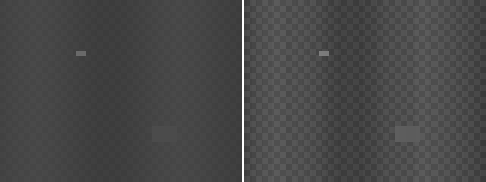

# RAW Viewer —— CMOS 传感器 RAW 图预览 / 测量 / 缺陷分析工具

面向 sensor 测试开发日常：拿到一份 *headerless* RAW dump 之后，快速看清它、
量出关键指标、找出坏点坏线、把结论导出成可以交给别人的表格和图。

PyQt6 + numpy（16bit PNG/TIFF 导出是手写的，不依赖 PIL）。**OpenCV 是可选加速依赖**：
装了热点路径自动切过去，没装则走纯 numpy 回退，功能完全一致。

```
python -m venv .venv && source .venv/bin/activate
pip install -r requirements.txt              # PyQt6, numpy（必需）
pip install -r requirements-optional.txt     # opencv-python-headless（可选，强烈建议）
python main.py
```

> 可选依赖务必装 **headless** 版：`opencv-python` 自带一套 Qt，会和 PyQt6 抢平台插件导致启动崩溃。
> 当前后端显示在「显示」面板底部与 Help 里；`RAWV2_NO_CV2=1` 可强制走 numpy 回退。


---

## 1. 打开文件：先解决"这份 dump 到底怎么解"

`File → Open RAW…` 弹出的参数对话框和旧版完全不同：

| 能力 | 说明 |
|---|---|
| **按文件大小自动推断** | 双击候选即套用。会匹配常见 sensor 分辨率，并识别行 padding（`stride`）、位深、packed 组合。 |
| **实时尺寸校验** | 底部随时显示 `行字节 / 单帧大小 / 需要多少字节 / 文件实际多少字节`，匹配则绿色 ✔，不足则红色 ✘。旧版是"读到后面才发现对不上"或静默截断。 |
| **完整布局参数** | packing（MIPI RAW10/12/14 packed）、header 字节、行 stride、字节序（little/big）、左对齐位移 `data_shift`、多帧文件的帧号 / 帧 stride。 |
| **参数预设** | 常见的几种 dump 布局存成预设（QSettings 持久化），下次一键套用。 |
| **CFA 默认 Mono** | 灰度数据不会被默认染成彩色网点（旧版默认 RGGB，是个坑）。 |

支持的读取格式：

* `unpacked`：8 / 10 / 12 / 14 / 16 bit（10/12/14bit 可放在 16bit 容器里，用 `data_shift` 右移对齐）；
* `packed`：MIPI RAW10（4px/5B）、RAW12（2px/3B）、RAW14（4px/7B）——位序按 MIPI/V4L2 规范实现，并与公开 C 实现逐位对拍（见 `tests/test_raw_io.py`）；
* 行 stride / header / 大小端 / 多帧（`PgUp/PgDn` 换文件，`,`/`.` 换帧号）。

## 2. 看得清：显示管线

`Display` 页签里的每一步都是显式的，方便你解释"屏幕上看到的到底是什么"：

* **视图**：`Bayer Mosaic`（相位着色）、`Bayer Demosaic`（双线性）、`Mono`、以及单通道 `R / Gr / Gb / B / G plane`。
  单通道视图保持与 raw 相同的 H×W 坐标（非本相位像素置黑），所以 ROI、悬浮读数、像素检查器的坐标永远和 raw 一致，坏点定位不会错位。
* **拉伸**：`Fixed(黑白电平) / Min-Max / Percentile / Sigma`。
  暗场里只有几个亮坏点时百分位区间会退化成一条线（整幅全黑或全白），此时自动回退到 `mean±3σ`；完全均匀的画面也会给中间灰，不会一片死黑。
* **黑/白电平、Gamma、反相、伪彩**（Gray / Jet / Turbo / Hot / Viridis）；
* **局部对比度 CLAHE**（clip / tiles 可调）：暗场、低对比画面里看结构用；有 OpenCV 时走 cv2，否则退化为全局均衡。
  低对比阴影场景下左（原始）右（CLAHE）对比：

  

* **高质量缩小**（`Ctrl+Shift+Q`）：缩小时用区域平均（INTER_AREA）而不是最近邻，RAW 噪声图看起来干净得多。
* **自动电平 (Ctrl+L)**：把当前画面的百分位电平写死成固定黑白电平，方便锁定显示做前后对比。
* 缩放/平移后像素块严格对齐到整数物理像素（沿用之前修好的渲染路径），放大到单像素时块等宽、与网格线严格重合；`G` 切像素网格+数值，`C` 切十字线。

## 3. 量得准：ROI 与测量面板

在图上**右键拖拽**（或打开 `ROI Select Mode` 后左键拖拽）框选 ROI，底部 `Measure` 面板立刻跟着更新：

* **Statistics**：总体 + 分通道（R/Gr/Gb/B）的 count / mean / std / min / max / median / P1 / P99 / 饱和数 / 0DN 数 / SNR(dB)；
  自动提示"饱和像素 x 个（可能过曝）"、"0DN 像素 x 个"、"Gr/Gb 均值差 x%"（绿通道失配）。下面是直方图（可切对数纵轴、分通道曲线、bins）。
* **Profile**：ROI 的行/列均值曲线（含分通道曲线与 ±3σ 包络），行 FPN、坏行、阴影一眼可见；鼠标悬停读数，单击可定位。
* **像素检查 Inspector**：单击画布任意像素，看它周围 (2r+1)² 的原始 DN，按相位着色，标出中心点与邻域通道和 —— 定位坏点时用。
* **缺陷 Defects**：见下一节。

ROI 尽量用全局像素坐标计算相位，**奇数起点的 ROI 也不会串通道**（`utils/cfa.py::phase_planes`），这是所有分通道统计正确的前提。

## 4. 找得出：算法

`Algorithms` 页签，勾选"只在 ROI 内运行"可以做局部缺陷扫描。运行结果会累积到缺陷清单里（可导出成一张 CSV）。

| 算法 | 关键点 |
|---|---|
| **Bad Pixel Detection** | 同色邻域中值比对（CFA 下 R 只和 R 比）；自适应阈值 `\|Δ\| > max(k·σ_MAD, 最小偏差)`；区分 hot / dead / cluster；2×2 跨相位簇也能识别（先膨胀再连通标记）；大簇自动聚合成一条带包围盒的记录，整行/整列坏点会拆成 `row`/`col` 条目（不会刷出几千条明细）；可选"用同色邻域中值校正"，校正结果可 `Ctrl+Z` 撤销。 |
| **Bad Line Detection** | 按相位分平面后用**相邻行的局部中值**作参考，所以画面有阴影/暗角梯度时不会整片误报（用全图 median 的写法会）；支持整行/整列或分段（`block_size`）检测，多相位命中的同一行会合并成一条。 |
| **Shading / Vignetting** | 分块统计各相位均值，报告 shading 幅度、块极值、四角/中心比；标出异常块；可选生成平坦场校正图。 |
| **Saturation / Clipping** | 分通道饱和/0DN 计数与比例、过曝区域的块状分布、少量饱和像素逐点入清单 —— 曝光与动态范围验收用。 |
| **Frame Diff vs Reference** | 与参考帧比较：PSNR / RMSE / max\|Δ\| / 差异像素比例，列出偏差大的像素。两帧暗场对比可区分随机噪点与固定坏点；跑完校正后对比原图可确认只动了该动的点。 |

## 5. 坐标跳转（定位到指定像素）

工具栏上的 `坐标 X,Y` 输入框（或 `Analyze → Jump to Coordinate…`，快捷键 **Ctrl+G**）：

* 支持直接粘贴各种格式：`1234,567`、`1234 567`、`(1234, 567)`、`x=1234 y=567`，输入非法会红框并禁用按钮；
* **1-based 开关**：Matlab / Excel / 部分测试报告的行列号从 1 开始，勾上即可按 1 开始解释（差 1 像素在坏点定位上是致命的）；
* **缩放选项**：保持当前缩放 / 1:1 / 8× / 20× / 50× / 100×（默认 20×，足够看清 CFA 相位）；
* 跳转后该像素居中显示（按像素中心对齐，不偏半格）、被打上选中十字线、像素检查器自动切到前面并显示它周围的原始 DN；状态栏给出 `X/Y 坐标 + 通道 + DN` 反馈；
* 坐标越界会自动夹回画内并在状态栏注明，不会静默跳错地方；
* 在画布上单击任意像素会把坐标**回填**到输入框，缺陷清单双击定位也会同步 —— 方便"从这里往旁边再跳 5 个像素"。

## 6. 对比与验证

`Ctrl+D` 打开对比模式（`File → Open Reference Image…`，尺寸/布局一致时直接套用当前参数）：

* **并排 Side-by-side**：两幅同步缩放平移；
* **差分 Difference**：`|当前 − 参考|` 用 Hot 伪彩显示，状态栏给出 PSNR/RMSE/max|Δ| —— 检查校正算法改动量最直观；
* **混合 Blend 50%**：叠加对比。

**自动对齐参考帧**（`Ctrl+Shift+D`）：两帧不完全对齐（重新装夹、机台漂移）时，先用相位相关
测出平移量再对齐，状态栏给出 `平移 (+3.00, -5.00) px, 响应 0.986 | PSNR 36.8 → 65.9 dB`。
亚像素平移走 OpenCV，缺 OpenCV 时退化为整像素。

校正类算法（坏点校正、平坦场校正）跑完后，程序会**自动把原图设为参考帧**，直接切到差分视图就能看改动量；
`Ctrl+Z` 撤销校正时参考帧一起撤掉（否则差分视图会全黑、报告 PSNR 变成 inf）。
参考帧会在状态栏常驻显示（`ref:xxx.raw`），换文件时尺寸不一致就自动清除，不会悄悄生效。

## 7. 一键测量与批量

* **估计黑电平**（`Ctrl+B`）：框了 ROI 就用 ROI 中值（光学黑区），否则用全图直方图峰值 —— 只在暗场可信，
  亮场会明确提示不可信而不是给个错值；ROI 电平偏高时提醒你确认框的是不是 OB 区。
* **批量分析**（`Ctrl+Shift+B`）：多选一批 RAW → 逐帧算出
  `mean/std/min/max/median/sat%/zero%/黑电平估计/坏点数` → 导出汇总 CSV，
  带进度条与取消；布局与当前参数不匹配的文件会跳过并在结果里说明。
* **导入缺陷清单 CSV**：把之前导出的（或上游给出的）缺陷清单载入并叠加到画布上，
  和当前检测结果对拍；来源会标成 `CSV: 文件名` 显示在缺陷表里。

## 8. 导出

| 导出 | 用途 |
|---|---|
| `Export Display Image (PNG)` | 屏幕上看到的样子（含当前拉伸/伪彩）。 |
| `Export RAW DN (16bit PNG/TIFF)` | **未经显示变换**的原始 DN，位深不丢，给算法/ISP 同事复算。 |
| `Export Annotated Snapshot (PNG)` | 把缺陷标注烧进图里的截图，贴 bug 单/报告用。 |
| `Export Measurement Report (MD)` | Markdown 报告：文件布局、ROI 统计表、profile 摘要、与参考帧的差分指标、缺陷汇总、最近一次算法输出。 |
| 统计 CSV / 缺陷 CSV | `scope,channel,count,mean,std,...` / `type,x,y,channel,value,delta,note,source`，直接进 Excel 或 yield 分析。 |

## 9. 快捷键

```
Ctrl+O 打开 RAW         Ctrl+R 打开参考帧        Ctrl+Shift+R 重新读盘
Ctrl+E 导出显示图       Ctrl+Shift+E 导出原始 DN  Ctrl+L 自动电平
Ctrl+D 对比模式         Ctrl+A ROI=全图          Esc 清除 ROI
Ctrl+G 坐标跳转（支持 1234,567 粘贴 / 1-based）
Ctrl+B 估计黑电平      Ctrl+Shift+B 批量分析      Ctrl+Shift+D 参考帧自动对齐
Ctrl+Shift+Q 高质量缩小（INTER_AREA）
Ctrl+Z 撤销校正         Ctrl+M 重算测量
F 适应窗口              1 1:1                    +/- 缩放      G 网格/数值   C 十字线
PgUp/PgDn 上一个/下一个文件                      ,/. 上一帧/下一帧
鼠标：左键拖拽=平移；ROI 模式或右键拖拽=框选；单击=选点检查；滚轮=以指针为中心缩放
```

## 10. 目录结构

```
main.py                  入口
ui/main_window.py        主窗口：动作/菜单/工具栏、加载、测量、算法调度、对比、导出
ui/canvas.py             画布：像素对齐渲染、ROI、叠加层、十字线、缩放平移
ui/dialogs.py            打开参数对话框（自动推断 + 实时校验 + 预设）
ui/goto_box.py           坐标跳转输入框（多种粘贴格式 / 1-based / 缩放选项）
ui/sidebar.py            显示控制面板 / 算法面板
ui/stats_panel.py        统计 / Profile / 检查器 / 缺陷 四个页签
ui/plots.py              直方图与 profile 绘图控件（无 matplotlib 依赖）
ui/qtutil.py             UI 小工具：等宽字体解析（避免 Qt 字体别名枚举）、绘制保护
utils/raw_io.py          RAW 读取：packed/stride/header/字节序/多帧/几何推断
utils/cfa.py             CFA 相位：拆平面、全局相位映射（支持奇数起点 ROI）
utils/display.py         显示管线：电平/拉伸/gamma/伪彩/单通道视图/demosaic
utils/stats.py           测量：分通道统计、直方图、ROI、行列表 profile、差分指标
utils/export.py          16bit PNG / 基线 TIFF / CSV / 标注截图
utils/accel.py           可选加速后端：OpenCV 与 numpy 回退（demosaic/连通域/形态学/CLAHE/配准/缩小）
utils/batch.py           批量分析：单帧指标、黑电平估计、汇总 CSV
utils/image_loader.py    兼容层（老接口转发到新实现，避免两份逻辑）
algorithms/              算法框架 + 五个算法（base 里写明了 run() 的输入输出协议）
generate_sample.py       合成测试素材生成器（多场景 + 多布局）
tests/                   8 套测试，tests/run_all.py 一键全跑
docs/                    截图与导出示例
```

## 11. 造测试素材

`generate_sample.py` 能合成带已知缺陷的场景，并且能按各种布局落盘，用来验证读取与检测：

```bash
python generate_sample.py --scene list                    # 看有哪些场景
python generate_sample.py --scene dark                    # 暗场：FPN+噪声+好坏点+坏行坏列+2x2簇
python generate_sample.py --scene shading --bit-depth 12  # 阴影/暗角
python generate_sample.py --scene dark --packing packed    # MIPI RAW10 packed
python generate_sample.py --scene dark --header 16 --stride-pad 64 --endian big
python generate_sample.py --scene dark --frames 3          # 多帧 dump
python generate_sample.py --scene saturated --meta inj.json # 同时导出注入缺陷清单
```

生成时会把注入缺陷的坐标/类型打印出来（也可写 json），方便和软件检测结果对拍 —— `tests/test_defects.py` 里就是这么做的。

> 提示：检测暗场时记得把坏点算法的"最小偏差"调小（例如 `threshold=30`）。
> 默认 100 DN 适合黑电平较高的画面；黑电平只有 64 DN 时，dead 像素的偏差只有 64 DN，会被门限挡掉。

## 12. 性能（OpenCV 可选加速）

同一个工具、同一台机器（Apple Silicon，10 线程）、同一份数据，实测：

| 操作 | 纯 numpy | 有 OpenCV | 说明 |
|---|---|---|---|
| Demosaic 预览 1920×1080 | 56 ms | **0.4 ms** | 显示/对比视图整体 ~150× |
| Demosaic 4000×3000 | 327 ms | **1.8 ms** | |
| 坏点检测 4000×3000（均匀背景 + 百万像素亮块） | 482 ms | **432 ms** | 连通标记 2590 ms → 4.5 ms |
| 坏点检测 4000×3000（阈值过低、掩罩几乎全图的病态输入） | **1.8 s** | 1.8 s | 逐像素建列表 92 s → 1.8 s；逐行扫全簇 80 s → 1.8 s |
| 坏线检测（分段模式）4000×3000 | **120 ms** | 120 ms | 纯 numpy 向量化，2594 ms → 120 ms |
| 48MP（8000×6000）单次测量 | **0.21 s / 203 MB** | 同 | 原 0.94 s / 1226 MB |
| RAW10 packed 57 MB（8000×6000）读盘 | **0.53 s / 236 MB** | 同 | 原 938 MB 峰值 |
| CLAHE 1920×1080 | 全局均衡回退 | **1.1 ms** | 新功能 |
| 相位相关 4000×3000 | ~1 s（FFT 回退） | **205 ms** | 新功能 |

结论：OpenCV 主要赢在 **demosaic / 连通标记 / 形态学 / 缩小采样 / CLAHE / 亚像素配准**；
而"逐像素 Python 循环"这类问题不管有没有 OpenCV 都得靠向量化解决（坏线分段、大簇聚合、
按行程的连通标记都换成了纯 numpy 实现，没有 OpenCV 也不卡）。

## 13. 本轮修复的缺陷（有回归测试守着）

一轮独立代码审查 + 实测复现，修掉的问题（都在 `tests/` 里有对应断言）：

| 级别 | 问题 | 修复 |
|---|---|---|
| 高 | 坏点检测在百万像素缺陷块上要 **92 秒**（逐像素建 Python 列表） | 聚合改成按簇向量化归约 → 0.4 s |
| 高 | Shading 分块坐标漏乘 `step=2`：Bayer 下方框/坐标只有真值一半，双击定位跳错地方 | 乘上 step（`base + step*px`） |
| 高 | 槽函数异常没有兜底：文件被拔、参数残留时操作静默失败并留 traceback（部分 PyQt 版本还会 abort 进程） | 统一 `_guard` 包住所有菜单动作/信号槽 + 帧导航前后校验与回滚 |
| 中 | 自动电平抽样用偶数步长，与 CFA 相位混叠 → 12/24/48/64MP 图只有 2 个相位参与统计，另两路被截白/压黑 | 改奇步长抽样（`cfa.stratified_sample`） |
| 中 | 数据超过位深上限时直方图**静默丢计数**、横轴还只画到 `2^bit_depth-1` | 按真实上界出图，并在统计面板提示去查位深/data_shift |
| 中 | 48MP 单次测量峰值内存 1226 MB、阻塞 2.2 s | 统计去掉整块 float64 拷贝、逐通道曲线改在相位平面上算 → 0.21 s / 203 MB |
| 中 | packed 解码临时数组约为文件体积 16 倍（57 MB 文件峰值 938 MB） | 按行分块解码 → 236 MB |
| 中 | 统计/缺陷 CSV 导出没有异常保护，写到目录/只读位置就崩 | 统一保护 + 明确报错 |
| 中 | 帧数计算没扣 header，带 header 的多帧文件会报出多余帧数并把 `frame_index` 卡在坏值 | 扣减 header、越界纠正、读盘失败回滚 |
| 中 | 帧差算法在 ROI 模式下指标是整幅、清单是 ROI（同一条消息自相矛盾） | 指标也在 ROI 上算，消息标注 `[ROI]` |
| 低 | 竖直坏列被分解成 600 条 `row`（簇宽=1 导致"每行都算密行"） | 先判形状（细长竖直→列、细长水平→行）再拆密行/密列 |
| 低 | `connected_components` 的 `sizes[0]` 把背景面积算成区域 | `sizes[0] ≡ 0` |
| 低 | 形态学"去毛刺"会把 1 像素宽的坏线整个吃掉 | 换成按连通面积剔除孤立单点（不动坏线/坏块） |
| 低 | 单击选点用**松开**位置（手抖 1~2 px 就选到隔壁像素） | 改用按下位置（与 ROI 锚点一致） |
| 低 | 从图像外灰色区起拖 → ROI 出现负坐标，标签与实际统计区域不符 | 起点夹进画内 |
| 低 | 双击两个分支都是 1:1，已放大时双击不会适应窗口 | 放大→适应窗口，缩小→1:1 |
| 低 | 16bit RGB 存 TIFF 会被静默按 mod 256 截断 | 照实写 16bit RGB |
| 低 | `QImage.save` 返回值被忽略，写失败也报"已导出" | 检查返回值并报错 |
| 低 | 坐标输入 `-5,10` / `12.5,7` / `1e3,2` 会被静默解析成错误坐标 | 判为非法（红框禁用按钮） |
| 低 | 撤销校正后 `ref_raw` 未清 → 差分全黑、报告 PSNR=inf；换文件不清旧参考帧 | 自动参考随撤销清除；尺寸不符自动清、同尺寸保留并常驻显示 |
| 低 | 全黑/常值帧 SNR 显示 `inf`（像完美信号） | 显示 `n/a` |
| 低 | `frame_stride` 小于单帧字节数 → 帧静默重叠读出混合数据 | 加载时校验并报错 |
| 低 | 单通道视图下"电平按 ROI 计算"被静默忽略 | 与相位掩罩取交集 |
| 低 | 越界坐标 / 空数组调用统计 API 会抛 IndexError/ValueError | 夹紧或返回空，不再抛 |
| 低 | `QFont("Monospace")` 让 Qt 去枚举字体别名（每次启动 ~60-100 ms 并打印 `qt.qpa.fonts` 告警）；`QFontDatabase.systemFont(FixedFont)` 在 Qt6/macOS 上返回的还不是等宽字体 | 从真实存在的固定宽度族里挑（macOS→Menlo），样式表也写具体族名 |
| 低 | 停靠窗口/工具栏没设 `objectName` → Qt 打印 `saveState(): 'objectName' not set`，并且**布局记忆实际失效**（`restoreState` 返回 False） | 设置 objectName；`restoreState` 往返有测试守着 |
| 低 | 窗口析构时 Qt 仍派发 `paintEvent` → 访问已销毁的 C++ 对象抛 RuntimeError（绘制中抛异常很危险） | 自绘控件加 `safe_paint` 保护（只吞 RuntimeError） |

## 14. 测试

```bash
python tests/run_all.py              # 10 套，并自动用 RAWV2_NO_CV2=1 复跑 5 套（共 15 轮）
python tests/run_all.py --no-cv2     # 只跑 numpy 回退路径
```

覆盖要点：packed 位序与规范实现逐位一致、stride/header/字节序/多帧往返、几何推断、退化电平回退、
奇数起点 ROI 不串通道、demosaic 均匀性、统计数值精确性、五类算法的检出与误报、16bit PNG/TIFF 像素级无损、
以及一条完整的无头 UI 工作流（加载 → ROI → 统计 → 算法 → 校正/撤销 → 对比 → 导出 → 帧/文件切换）。
